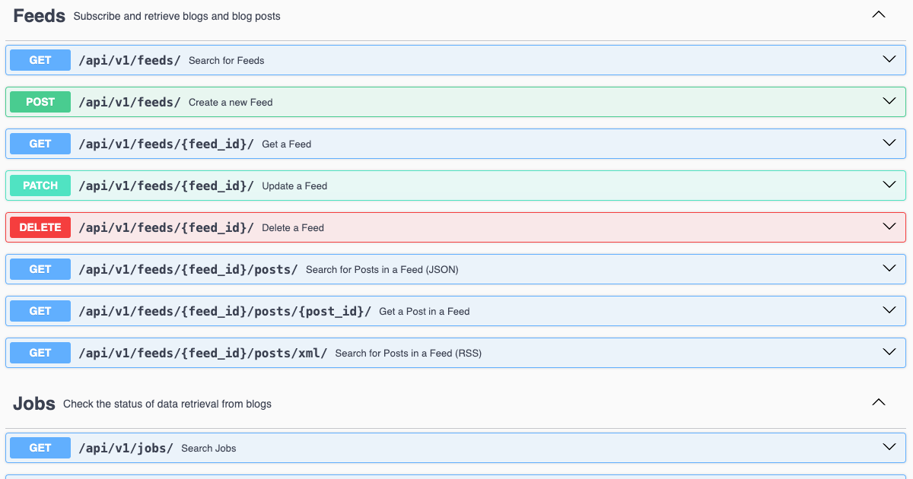

# history4feed

[](https://codecov.io/gh/muchdogesec/history4feed)

## Overview



It is common for feeds (RSS or XML) to only include a limited number of posts. I generally see the latest 3 - 5 posts of a blog in a feed. For blogs that have been operating for years, this means potentially thousands of posts are missed.

There is no way to page through historic articles using an RSS or ATOM feed (they were not designed for this), which means the first poll of the feed will only contain the limited number of articles in the feed. This limit is defined by the blog owner.

history4feed can be used to create a complete history for a blog and output it as an RSS feed.

history4feed offers an API interface that;

1. takes an RSS / ATOM feed URL
2. downloads a Wayback Machine archive for the feed
3. identified all unique blog posts in the historic feeds downloaded
4. downloads a HTML version of the article content on each page
5. stores the post record in the databases
6. exposes the posts as JSON or XML RSS

## tl;dr

[](https://www.youtube.com/watch?v=z1ATbiecbg4)

[Watch the demo](https://www.youtube.com/watch?v=z1ATbiecbg4).

## Install

### Download and configure

```shell
# clone the latest code
git clone https://github.com/muchdogesec/history4feed
```

### Configuration options

history4feed has various settings that are defined in an `.env` file.

To create a template for the file:

```shell
cp .env.example .env
```

To see more information about how to set the variables, and what they do, read the `.env.markdown` file.

### Build the Docker Image

```shell
sudo docker compose build
```

### Start the server

```shell
sudo docker compose up
```

### Access the server

The webserver (Django) should now be running on: http://127.0.0.1:8002/

You can access the Swagger UI for the API in a browser at: http://127.0.0.1:8002/api/schema/swagger-ui/

## Useful supporting tools

* [Full Text, Full Archive RSS Feeds for any Blog](https://www.dogesec.com/blog/full_text_rss_atom_blog_feeds/)
* [An up-to-date list of threat intel blogs that post cyber threat intelligence research](https://github.com/muchdogesec/awesome_threat_intel_blogs)
* [Donate to the Wayback Machine](https://archive.org/donate)

## Support

[Minimal support provided via the DOGESEC community](https://community.dogesec.com/).

## License

[Apache 2.0](/LICENSE).